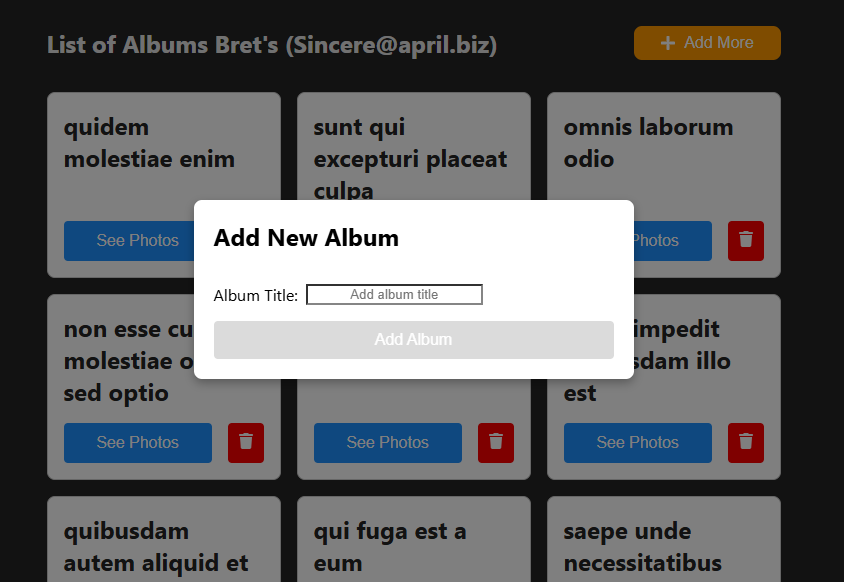

# Family Photo Management

This repository contains the code for the Family Photo Management application, which includes both **back-end** and **front-end** components. Below are the instructions for running both environments locally.

## Table of Contents

- [Development Environment Links](#deployed-environment-links)
- [Prerequisites](#prerequisites)
- [How to Clone Repository](#how-to-clone-repository)
- [Back-end Setup](#back-end-setup)
- [Front-end Setup](#front-end-setup)
- [Environment Variables](#environment-variables)
- [Application Screenshots](#application-screenshots)

---

## Deployed Environment Links

Here are the links to the deployed environments for the application:

- Back-end Deployed Environment:https://family-photo-management-api.vercel.app/api
- Front-end Deployed Environment: https://family-photo-management.vercel.app

---

## Prerequisites

Before you begin, make sure you have the following installed on your machine:

- [Node.js](https://nodejs.org/) (recommended version: >=22.13 LTS)
- [npm](https://www.npmjs.com/)
- [Git](https://git-scm.com/)

## How to Clone Repository

1. Go to the terminal and press:

```bash
git clone https://github.com/IsabelaFonseca-dti/family-photo-management.git
cd family-photo-management
```

You should be able to visualize both api and front end's projects.

## Back-end Setup

1. To run the back-end locally:

```bash
cd family-photo-management-api
```

2. Install Dependencies:

```bash
npm install
```

3. Create a .env file inside this family-photo-management-api folder and add the following variables:

```bash
HTTP_BASE_URL=https://jsonplaceholder.typicode.com
ALLOWED_CORS_ORIGINS=http://localhost:3000/api,http://localhost:5173,https://family-photo-management.vercel.app
```

4. Go back to the root:

```bash
cd ../
```

5. Run Application:

```bash
npm start
```

The back-end will be running at http://localhost:3000/api

6. Run tests:

```bash
npm run test
```

## Front End Setup

1. To run the front-end locally:

```bash
cd family-photo-management-front
```

2. Install Dependencies:

```bash
npm install
```

3. Create a .env file inside this family-photo-management-front folder and add the following variables:

```bash
VITE_API_LOCALHOST=http://localhost:3000/api
VITE_API_PUBLISHED_HOST=https://family-photo-management-api.vercel.app/api
VITE_API_LOCAL_RUNNING=true
```

You can choose if you like to run with the deployed version of the api or locally

4. Go back to the root:

```bash
cd ../
```

5. Run Application:

```bash
npm run dev
```

The front-end will be running at http://localhost:5173.

6. Run tests:

```bash
npm run test
```

## Application Screenshots

Here are some images showing how the application looks in action:


_Home page of the application._


_List of user's Albums._


_Modal of album's creation._


_List of user's Photos._


_Modal of Photos's creation._
